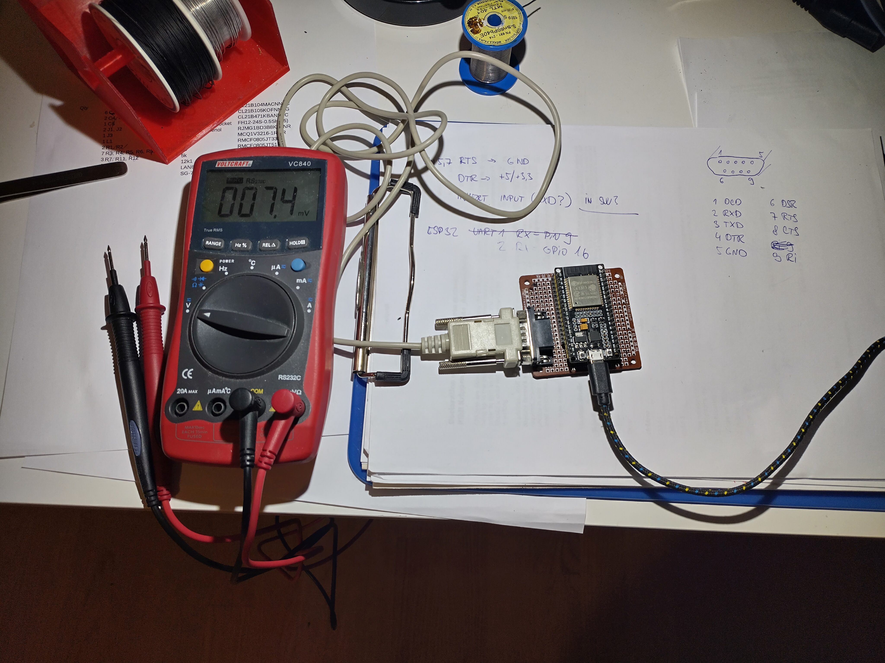

# UNI-T UT60E serial output decoder for MicroPython@ESP32

## Introduction

This multimeter uses quite funny protocol and the opto-isolation cable is known
for not working with most USB-Serial convertors because the cable is abusing old
tricks to power the circuitry for amplifying the singal from the opto-coupler.

However, it is easy to connect the opto-coupler to ESP32, power it directly from
3.3V rail and use ESP32's function to invert the RXD signal to avoid extra HW.

The protocol is described here https://sigrok.org/wiki/Multimeter_ICs#Fortune_Semiconductor_FS9721_LP3

## Tested HW

* works with UNI-T UT60E / Voltcraft VC840 - see https://sigrok.org/wiki/UNI-T_UT60E
* tested only with the original cable - see https://sigrok.org/wiki/Device_cables#UNI-T_UT-D02



## HW connection from the opto-coupler cable to ESP32

* connect DB-9 pins 5,7 (GND, RTS) to ESP32 GND
* connect DB-9 pin 4 (DTR) to ESP32 3.3V rail
* connect DB-9 pin 2 (RXD) to ESP32 GPIO 16

## Installation

* install MicroPython to the ESP32
* copy `main.py` to the MicroPython root
* reboot the ESP32
* connect to the console (i.e. `screen /dev/ttyUSB0 115200`)

## Output examples

The output is the printed tuple (value, unit, flags). This line is printed every time we receive a complete
transmission from the multimeter.

```
(10.0, 'Ohms', 'auto rs232')
(9.9, 'Ohms', 'auto rs232')
(10.1, 'Ohms', 'auto rs232')
```

```
(-79.6, 'mV', 'DC auto rs232')
(-79.7, 'mV', 'DC auto rs232')
(-79.7, 'mV', 'DC auto rs232')
```

```
(0.999, 'kHz', 'rs232')
(0.999, 'kHz', 'rs232')
(0.999, 'kHz', 'rs232')
```

```
(1.1, 'Ohms', 'rs232 beep')
(0.9, 'Ohms', 'rs232 beep')
(1.0, 'Ohms', 'rs232 beep')
```

```
(1.14, 'nF', 'auto rs232')
(1.15, 'nF', 'auto rs232')
(1.16, 'nF', 'auto rs232')
```
